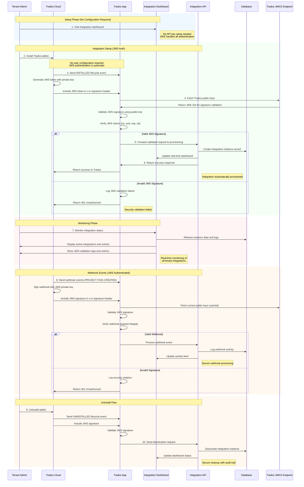

# Trados Cloud Integration Reference Implementation

A reference implementation demonstrating secure integration patterns between Trados Cloud addons and external systems using JWS (JSON Web Signature) authentication. This project intends to serve as a practical example for developers building integrations with Trados Cloud.

<u>**Important Note:**</u>

This readme and code in addition to the blueprint was entirely generated with the use of Claude AI.  The skill and capability of the RWS developers who put this entire platform together cannot be underestimated and they deserve a lot of credit for the work and skills involved.  After working on this with the help of Claude I can only dream of having the level of expertise involved!

## Overview

This reference implementation demonstrates:
- **JWS Authentication Patterns** with cryptographic signature validation
- **Multi-tenant Integration Architecture** with automatic provisioning
- **Addon Lifecycle Handling** for install/uninstall operations
- **Real-time Monitoring Dashboard** for development and testing
- **Security Best Practices** for Trados Cloud integrations

## Purpose

This repository provides a working reference for developers who need to:
- Build secure integrations with Trados Cloud addons
- Implement JWS (JSON Web Signature) authentication patterns
- Handle multi-tenant scenarios with automatic provisioning
- Understand Trados Cloud addon lifecycle events
- See practical examples of integration monitoring and management

## Architecture Overview

This reference implementation demonstrates a complete JWS-authenticated integration flow between a Trados Cloud addon and an external system.



## Security Features

### JWS Authentication
- **Algorithm**: RS256 (RSA Signature with SHA-256)
- **Signature**: Trados signs requests with private key
- **Validation**: App validates using Trados public keys from JWKS endpoint
- **Claims Validation**: Issuer, audience, expiration, and issued-at-time verification
- **No User Secrets**: No API keys or secrets for users to manage

### Automatic Provisioning
- **Zero Configuration**: No user setup required during addon installation
- **Tenant Isolation**: Automatic tenant identification from JWS claims
- **Credential Management**: Client credentials automatically provided during registration
- **Secure by Default**: All authentication handled cryptographically

### Components

1. **Trados Addon** (`Rws.LC.AppBlueprint/`)
   - C# .NET Core application
   - Handles Trados Cloud lifecycle events (install/uninstall)
   - Implements JWS signature validation using RSA public keys
   - Manages tenant provisioning automatically

2. **Integration API Reference** (`v1/` endpoints)
   - Demonstrates JWS signature validation patterns
   - Shows automatic tenant provisioning
   - Example of secure webhook processing
   - Real-time dashboard with JWS authentication logs

## Development Setup (Reference Implementation)

### Author's Development Environment
This reference implementation was developed and tested using:
- **XAMPP** for local PHP development with SQLite
- **ngrok** for external tunneling during Trados Cloud testing
- **Visual Studio** for C# addon development
- **Local SQLite database** for simplicity in development

### Repository Contents
This repository contains:
- Complete Trados Cloud addon implementation with JWS authentication
- JWS signature validation reference code
- API endpoint examples for automatic provisioning
- Database schema examples for multi-tenant data
- Security pattern demonstrations

## Using This Reference Implementation

### For Integration Developers

1. **JWS Authentication Patterns**
   - Examine JWS validation in `validateJwsSignature()` function
   - Review public key fetching from Trados JWKS endpoint
   - Understand RSA signature verification using OpenSSL

2. **Security Implementation**
   - Cryptographic signature validation (no shared secrets)
   - Automatic tenant identification from JWS claims
   - Public key caching and rotation handling

3. **Adapt Integration Patterns**
   - Modify JWS validation for your requirements
   - Implement your own provisioning logic
   - Build appropriate dashboard/monitoring systems

### For Understanding Trados Cloud Integration

1. **Addon Structure and Configuration**
   - Review `descriptor.json` for addon configuration patterns
   - Study lifecycle event handling (INSTALLED/UNINSTALLED)
   - Learn automatic provisioning without user configuration

2. **Security Implementation Examples**
   - Complete JWS authentication implementation
   - Automatic tenant isolation techniques
   - Webhook signature validation patterns

## API Endpoints

### App Lifecycle Endpoint
```
POST /v1/app-lifecycle
Content-Type: application/json
x-lc-signature: <jws_token>

{
  "timestamp": "2019-08-24T14:15:22Z",
  "clientId": "string",
  "clientSecret": "string",
  "id": "INSTALLED|UNINSTALLED"
}
```

### Webhook Endpoint
```
POST /v1/webhooks
Content-Type: application/json
x-lc-signature: <jws_token>

{
  "events": [
    {
      "eventType": "PROJECT.TASK.CREATED",
      "eventData": {
        "taskId": "string",
        "projectId": "string",
        "accountId": "string"
      }
    }
  ]
}
```

### Response Format
```json
{
  "success": true,
  "instanceId": "trados_instance_12345_abcdef",
  "tenantId": "tenant_id",
  "eventType": "INSTALLED",
  "timestamp": "2025-07-15 12:34:56",
  "message": "Integration processed successfully"
}
```

## Database Schema

### Integration Controls
```sql
CREATE TABLE integration_controls (
    id INTEGER PRIMARY KEY AUTOINCREMENT,
    instance_id TEXT NOT NULL UNIQUE,
    tenant_id TEXT NOT NULL,
    client_id TEXT NOT NULL,
    client_secret TEXT NOT NULL,
    configuration_data TEXT,
    status TEXT DEFAULT 'pending' CHECK(status IN ('active', 'pending', 'error', 'inactive')),
    created_at DATETIME DEFAULT CURRENT_TIMESTAMP,
    last_activity DATETIME,
    metadata TEXT
);
```

### Activity Logs
```sql
CREATE TABLE activity_logs (
    id INTEGER PRIMARY KEY AUTOINCREMENT,
    instance_id TEXT,
    timestamp DATETIME DEFAULT CURRENT_TIMESTAMP,
    level TEXT DEFAULT 'info' CHECK(level IN ('success', 'info', 'warning', 'error')),
    message TEXT NOT NULL,
    details TEXT,
    request_data TEXT,
    response_data TEXT,
    user_agent TEXT,
    ip_address TEXT
);
```

### Webhook Events
```sql
CREATE TABLE webhook_events (
    id INTEGER PRIMARY KEY AUTOINCREMENT,
    instance_id TEXT,
    event_type TEXT NOT NULL,
    payload TEXT,
    headers TEXT,
    timestamp DATETIME DEFAULT CURRENT_TIMESTAMP,
    processed INTEGER DEFAULT 0,
    processing_result TEXT
);
```

## Security Implementation Reference

### JWS Authentication Pattern
- **Algorithm**: RS256 (RSA with SHA-256)
- **Signature Source**: Trados Cloud private key
- **Validation**: Using Trados public keys from JWKS endpoint
- **Claims Validation**: iss, aud, exp, iat verification
- **No Shared Secrets**: Public key cryptography eliminates secret management

### Automatic Tenant Provisioning
- **Zero Configuration**: No user setup during addon installation
- **Tenant Identification**: Automatic from JWS claims (aid claim)
- **Credential Delivery**: Client credentials provided during INSTALLED event
- **Instance Isolation**: Each tenant gets isolated integration instance

## Development Considerations

### JWS Validation Implementation
```php
// Key validation steps:
1. Split JWS token into header.payload.signature
2. Decode header to get algorithm (RS256) and key ID (kid)
3. Fetch public key from Trados JWKS endpoint
4. Calculate payload hash (always empty body for Trados)
5. Verify signature using RSA public key
6. Validate claims (issuer, audience, expiration)
```

### Security Enhancements for Production
- Implement proper JWS token caching and key rotation
- Add comprehensive logging for JWS validation failures
- Implement rate limiting on webhook endpoints
- Add monitoring for signature validation metrics
- Use proper HTTPS certificates and TLS configuration
- Implement database backup and disaster recovery procedures
- Add request size limits and timeout configurations
- Implement proper input validation and sanitization

## Reference Implementation Features

### Dashboard Features
- Automatic tenant integration tracking
- JWS authentication status monitoring
- Activity audit trails with signature validation logs
- Real-time webhook event processing
- System health status indicators
- Instance credential management (ClientID/Secret viewing)

### Learning Resources
- Complete JWS authentication implementation
- Trados Cloud addon lifecycle event handling
- Multi-tenant architecture with automatic provisioning
- Security validation examples with detailed logging
- Database schema design for webhook-driven integrations

## File Structure

```
├── Rws.LC.AppBlueprint/          # Trados addon (C#)
│   ├── Controllers/
│   │   ├── StandardController.cs # Main lifecycle and integration logic
│   │   └── WebhookController.cs  # Webhook event handling
│   ├── descriptor.json          # Addon configuration (no API key required)
│   └── appsettings.json         # Application settings
├── v1/
│   ├── app-lifecycle.php        # Lifecycle event handler
│   ├── webhooks.php             # Webhook event processor
│   └── health.php               # Health check endpoint
├── includes/
│   ├── database.php             # Database connection and schema
│   └── functions.php            # JWS validation and utility functions
├── index.php                    # Integration dashboard
└── database-viewer.php          # Database inspection tool
```

### Key Reference Functions
- `validateJwsSignature()`: Complete JWS signature validation
- `getTradosPublicKey()`: Fetching and caching Trados public keys
- `convertJwkToPublicKey()`: Converting JWK format to OpenSSL-compatible PEM
- `createIntegrationControl()`: Automatic tenant provisioning
- `logActivity()`: Comprehensive audit logging

## Testing the Reference Implementation

### Integration Testing
1. Install Trados addon (no configuration required)
2. Verify automatic integration provisioning in dashboard
3. Test webhook event processing with JWS validation
4. Test uninstall flow and verify cleanup
5. Monitor logs for proper JWS validation

### Security Testing
- Test JWS signature validation with various scenarios
- Verify proper handling of expired tokens
- Test with invalid signatures and malformed tokens
- Validate tenant isolation between different installations
- Test webhook replay attack prevention

## Extending This Reference

### Common Adaptations
- Replace SQLite with production database
- Implement webhook event processing for your use case
- Add comprehensive error handling and retry logic
- Build production-grade user interfaces
- Add monitoring and alerting for JWS validation failures
- Implement webhook event queuing and processing

### Integration Patterns to Study
- JWS signature validation with public key cryptography
- Addon descriptor configuration (zero user configuration)
- Lifecycle event handling (install/uninstall)
- Webhook event processing with authentication
- Multi-tenant data isolation with automatic provisioning
- Real-time monitoring and logging

## Migration from API Key Authentication

If you're migrating from API key-based authentication:

1. **Remove API Key Configuration**: Update descriptor.json to remove API key requirements
2. **Implement JWS Validation**: Replace HMAC validation with JWS signature verification
3. **Update Provisioning Logic**: Remove API key dependency, use automatic tenant identification
4. **Simplify User Experience**: No configuration screens needed during installation

## Contributing

This is a reference implementation for educational purposes. Contributions that improve:
- JWS validation patterns and security
- Code clarity and documentation
- Integration pattern demonstrations
- Educational value for developers

Are welcome.

## Resources

- [Trados Cloud Extensibility Documentation](https://eu.cloud.trados.com/lc/extensibility-docs)
- [JSON Web Signature (JWS) RFC 7515](https://tools.ietf.org/html/rfc7515)
- [JSON Web Key (JWK) RFC 7517](https://tools.ietf.org/html/rfc7517)