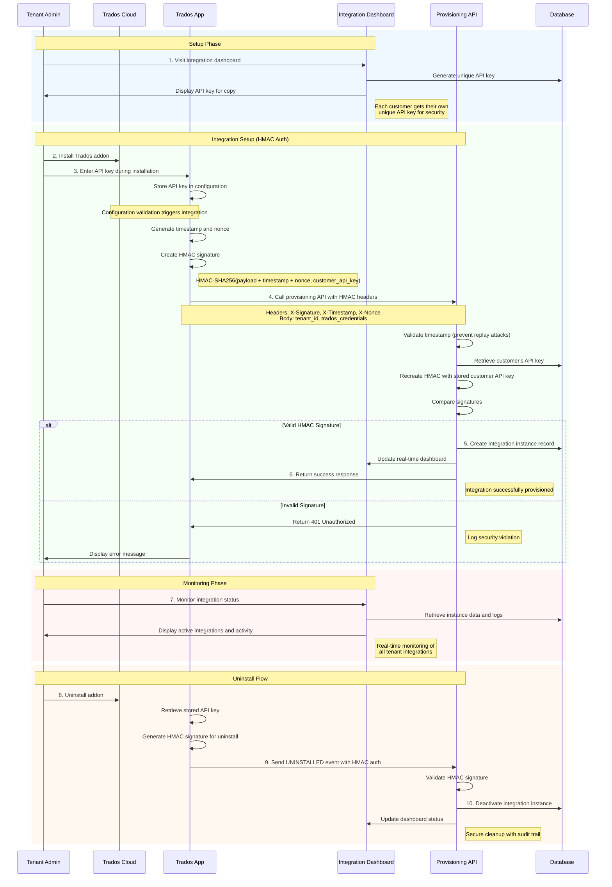

# Trados Cloud Integration Reference Implementation

A reference implementation demonstrating secure integration patterns between Trados Cloud addons and external systems using HMAC-SHA256 authentication. This project serves as a simple example for developers building integrations with Trados Cloud.

## Overview

This reference implementation demonstrates:
- **HMAC Authentication Patterns** with timestamp-based replay protection
- **Multi-tenant Integration Architecture** with API key management
- **Addon Lifecycle Handling** for install/uninstall operations
- **Real-time Monitoring Dashboard** for development and testing
- **Security Best Practices** for Trados Cloud integrations

## Purpose

This repository provides a working reference for developers who need to:
- Build secure integrations with Trados Cloud addons
- Implement HMAC-SHA256 authentication patterns
- Handle multi-tenant scenarios with proper isolation
- Understand Trados Cloud addon lifecycle events
- See practical examples of integration monitoring and management

## Architecture Overview

## Architecture Overview

This reference implementation demonstrates a complete HMAC-authenticated integration flow between a Trados Cloud addon and an external provisioning system.



## Security Features

### HMAC Authentication
- **Algorithm**: HMAC-SHA256
- **Signature**: `HMAC-SHA256(payload + timestamp + nonce, api_key)`
- **Headers**: `X-Signature`, `X-Timestamp`, `X-Nonce`
- **Replay Protection**: Timestamp validation prevents replay attacks

### API Key Management
- **Customer Self-Service**: Unique API keys generated per customer
- **Secure Storage**: Keys stored in SQLite with proper isolation
- **Rotation Support**: Easy regeneration via dashboard interface
- **Multi-tenant**: Each customer gets their own unique key

### Components

1. **Trados Addon** (`Rws.LC.AppBlueprint/`)
   - C# .NET Core application
   - Handles Trados Cloud lifecycle events (install/uninstall)
   - Implements HMAC-SHA256 request signing
   - Manages tenant configuration and API key storage

2. **Integration API Reference** (`provision-instance.php`)
   - Demonstrates HMAC-signed request validation
   - Shows multi-tenant instance management patterns
   - Example of secure provisioning/deprovisioning logic
   - *Note: Full dashboard implementation not included in this repository*

## Development Setup (Reference Implementation)

### Author's Development Environment
This reference implementation was developed and tested using:
- **XAMPP** for local PHP development with SQLite
- **ngrok** for external tunneling during Trados Cloud testing
- **Visual Studio** for C# addon development
- **Local SQLite database** for simplicity in development

*Note: I haven't provided details of my code for this as the focus here is on the Trados Cloud part.*

### Repository Contents
This repository contains:
- Complete Trados Cloud addon implementation
- HMAC authentication reference code
- API endpoint examples for provisioning
- Database schema examples
- Security pattern demonstrations

*The complete dashboard implementation is not included - only the core integration patterns and addon code.*

## Development Usage

## Using This Reference Implementation

### For Integration Developers

1. **A Study Guide for one way to provide an Addon Implementation**
   - Examine HMAC authentication patterns in `StandardController.cs`
   - Review lifecycle event handling in `AppLifecycle()` method
   - Understand configuration management and API key handling

2. **How I used Security Patterns**
   - HMAC-SHA256 signature generation and validation
   - Timestamp-based replay attack prevention
   - Multi-tenant API key isolation techniques

3. **Adapt Integration Patterns**
   - Modify authentication for your requirements
   - Implement your own provisioning logic
   - Build appropriate dashboard/monitoring systems

### For Understanding Trados Cloud Integration

1. **Addon Structure and Configuration**
   - Review `descriptor.json` for addon configuration patterns
   - Study lifecycle event handling (INSTALLED/UNINSTALLED)
   - Learn configuration validation timing and patterns

2. **Security Implementation Examples**
   - Complete HMAC authentication implementation
   - Secure API key management patterns
   - Multi-tenant isolation techniques

## API Endpoints

### Provisioning Endpoint
```
POST /provision-instance.php
Content-Type: application/json
X-Signature: <hmac_signature>
X-Timestamp: <unix_timestamp>
X-Nonce: <random_nonce>

{
  "tenantId": "string",
  "clientCredentials": {
    "clientId": "string",
    "clientSecret": "string"
  },
  "eventType": "INSTALLED|UNINSTALLED",
  "configurationData": {}
}
```

### Response Format
```json
{
  "success": true,
  "instanceId": "ic_instance_12345_abcdef",
  "tenantId": "tenant_id",
  "eventType": "INSTALLED",
  "timestamp": "2025-07-13 21:46:12",
  "message": "Integration Control processed successfully"
}
```

## Database Schema

### Integration Controls
```sql
CREATE TABLE integration_controls (
    instance_id TEXT PRIMARY KEY,
    tenant_id TEXT NOT NULL,
    client_id TEXT NOT NULL,
    client_secret TEXT NOT NULL,
    api_key TEXT,
    status TEXT CHECK(status IN ('active', 'pending', 'error', 'inactive')),
    configuration_data TEXT,
    created_at TIMESTAMP DEFAULT CURRENT_TIMESTAMP,
    last_activity TIMESTAMP
);
```

### Activity Logs
```sql
CREATE TABLE activity_logs (
    id INTEGER PRIMARY KEY AUTOINCREMENT,
    timestamp TIMESTAMP DEFAULT CURRENT_TIMESTAMP,
    level TEXT NOT NULL,
    message TEXT NOT NULL,
    details TEXT,
    instance_id TEXT
);
```

## Security Implementation Reference

### HMAC Authentication Pattern
- **Algorithm**: HMAC-SHA256
- **Signature**: `HMAC-SHA256(payload + timestamp + nonce, api_key)`
- **Headers**: `X-Signature`, `X-Timestamp`, `X-Nonce`
- **Replay Protection**: Timestamp validation prevents replay attacks

### API Key Management Pattern
- **Self-Service Generation**: Unique API keys generated per integration
- **Secure Storage**: Keys stored with proper database isolation
- **Rotation Support**: Easy regeneration via dashboard interface
- **Multi-tenant Isolation**: Each integration gets its own unique key

## Development Considerations

### Likely Adaptations for Production
This reference implementation uses:
- **SQLite**: Better with production database (PostgreSQL, MySQL, etc.)
- **Local Storage**: Implement proper secret management
- **Basic Logging**: Enhance with structured logging and monitoring
- **Simple UI**: Build production-grade admin interface
- **Development URLs**: Configure proper production endpoints

### Security Enhancements for Production
- Remove hardcoded fallback values in HMAC functions
- Add rate limiting and DDoS protection on API endpoints
- Implement comprehensive error handling and structured logging
- Add monitoring and alerting systems for security events
- Use proper HTTPS certificates and TLS configuration
- Implement database backup and disaster recovery procedures
- Add API key rotation policies and automated expiration
- Implement proper input validation and sanitization
- Add request size limits and timeout configurations

## Reference Implementation Features

### Dashboard Features
- API key generation and management for testing
- Multi-tenant integration instance tracking
- Activity audit trails for debugging
- Real-time monitoring during development
- System health status indicators

### Learning Resources
- Complete HMAC authentication implementation
- Trados Cloud addon lifecycle event handling
- Multi-tenant architecture patterns
- Security validation examples
- Database schema design for integrations

## File Structure

```
├── Rws.LC.AppBlueprint/          # Trados addon (C#)
│   ├── Controllers/
│   │   ├── StandardController.cs # Main lifecycle and integration logic
│   │   ├── TestWebsiteProxyController.cs # Development proxy
│   │   └── IntegrationController.cs # Integration endpoints
│   ├── descriptor.json          # Addon configuration
│   └── appsettings.json         # Application settings
├── provision-instance.php       # Reference provisioning endpoint
├── includes/
│   ├── database.php             # Database connection example
│   └── functions.php            # Reference PHP functions
└── api/
    └── get-instance-details.php # Instance details API example
```

*Note: This repository contains the addon implementation and reference API examples. Complete dashboard implementation not included.*

### Key Reference Functions
- `GetTenantApiKey()`: Retrieving API keys from addon configuration
- `SendHmacSignedRequestAsync()`: HMAC signature generation and request sending
- `validateHmacSignature()`: Server-side HMAC signature validation
- `createIntegrationControl()`: Integration instance provisioning patterns
- `deactivateInstance()`: Secure instance cleanup patterns

## Testing the Reference Implementation

### Integration Testing
1. Generate test API key via dashboard
2. Install Trados addon with API key in development environment
3. Verify integration appears in dashboard
4. Test uninstall flow and verify cleanup
5. Monitor logs for proper HMAC validation

### Security Testing
- Test HMAC signature validation patterns
- Verify replay attack prevention mechanisms
- Test unauthorized access scenarios
- Validate API key isolation between tenants

## Extending This Reference

### Common Adaptations
- Replace SQLite with production database
- Implement OAuth 2.0 instead of HMAC (see documentation)
- Add webhook validation for incoming Trados events
- Implement proper secret management
- Add comprehensive error handling and retry logic
- Build production-grade user interfaces

### Integration Patterns to Study
- Addon descriptor configuration
- Lifecycle event handling (install/uninstall/update)
- Configuration validation patterns
- HMAC signature generation and validation
- Multi-tenant data isolation
- Real-time monitoring and logging

## Contributing

This is a reference implementation for educational purposes. Contributions that improve:
- Code clarity and documentation
- Security pattern examples
- Integration pattern demonstrations
- Educational value for developers

Are welcome.

## Resources

- [Trados Cloud Extensibility Documentation](https://eu.cloud.trados.com/lc/extensibility-docs)
- [HMAC Authentication Best Practices](https://tools.ietf.org/html/rfc2104)

